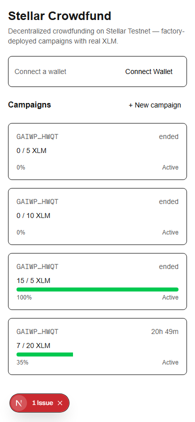
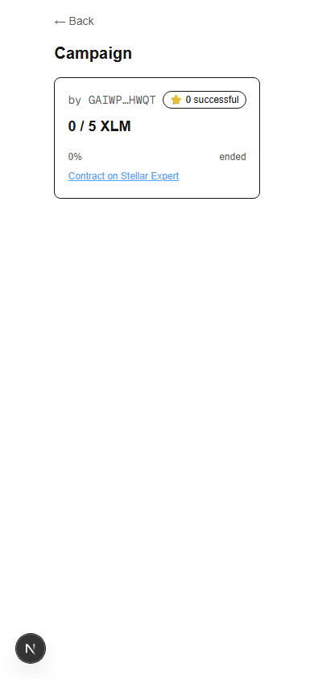
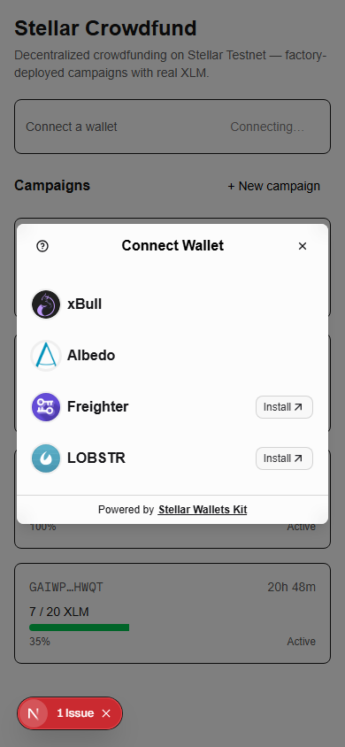
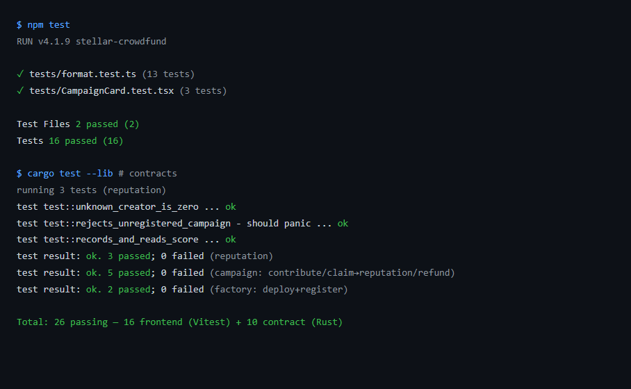
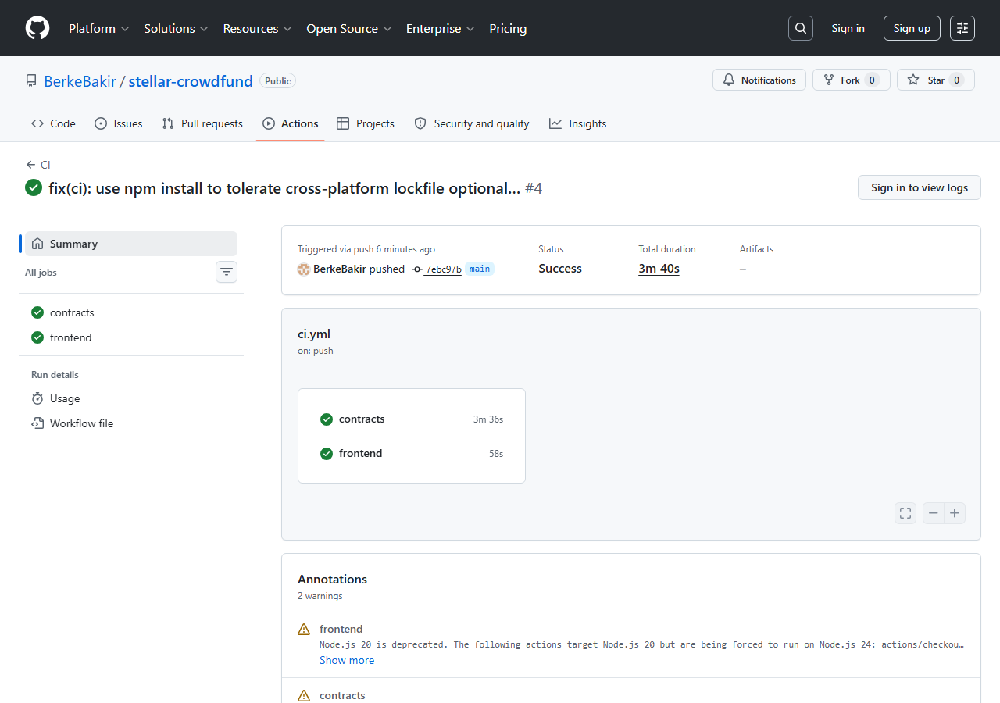

# Stellar Crowdfund 🟠


A production-shaped **decentralized crowdfunding** dApp on **Stellar Testnet**, built with a
**factory pattern** and **inter-contract communication**. A Factory contract deploys individual
Campaign contracts on-chain; contributors send **real Testnet XLM** (via the native Stellar Asset
Contract); if a campaign meets its goal the creator withdraws the funds and the campaign records the
creator's success in a **Reputation** contract; otherwise contributors reclaim their contributions.

Built for the **Stellar Journey to Mastery — Orange Belt** level.

🔗 **Live demo:** https://stellar-crowdfund-livid.vercel.app
🎬 **Demo video:** https://youtu.be/wQQR3vspj_o

> **Network:** Stellar **Testnet** only. No real funds are involved.

---

## Architecture — 3 contracts, 2 inter-contract edges

```
            create_campaign()                      record_success()
   ┌──────────┐  deploy + init   ┌──────────┐  on successful claim  ┌────────────┐
   │ Factory  │ ───────────────▶ │ Campaign │ ────────────────────▶ │ Reputation │
   │ registry │  (edge 1)        │  custody │   (edge 2)            │  scores    │
   └──────────┘ ◀─────────────── └──────────┘ ◀──── is_campaign() ──└────────────┘
                  is_campaign()        │  token.transfer (contribute / claim / refund)
                                       ▼
                            ┌────────────────────────┐
                            │ native XLM SAC (token)  │
                            └────────────────────────┘
```

- **Factory** — `create_campaign` deploys a new Campaign via the on-chain deployer, initializes it, and registers it; `list_campaigns`, `is_campaign`.
- **Campaign** — custodies real XLM. `contribute` (SAC transfer in), `claim` (creator withdraws once goal met after the deadline, then calls Reputation), `refund` (contributors reclaim if the goal is missed). State machine: Active → Claimed / Refunding. Emits `contrib` / `goal_met` / `claimed` / `refunded`.
- **Reputation** — `record_success` (callable only by a registered campaign, verified back through the Factory), `get_score`.

## Deployed on Testnet

| Contract | Address |
| --- | --- |
| **Factory** | [`CB7XBGQMQCABLW6YAHPDKNLPXZSG7TVAR6EZGVL4PKAQC4DLDVSFFXRW`](https://stellar.expert/explorer/testnet/contract/CB7XBGQMQCABLW6YAHPDKNLPXZSG7TVAR6EZGVL4PKAQC4DLDVSFFXRW) |
| **Reputation** | [`CDCW4N245PCGTYZOOSNY2PJXZMGU4B6GVVNX4FWHC34QPSC27FV5ZPQR`](https://stellar.expert/explorer/testnet/contract/CDCW4N245PCGTYZOOSNY2PJXZMGU4B6GVVNX4FWHC34QPSC27FV5ZPQR) |
| Campaign wasm hash | `8b06a0cf3140bbc9917c96a9e6252fc5ec9505d1b0ede82c1f274cd68d3c829f` |
| Native XLM SAC (token) | `CDLZFC3SYJYDZT7K67VZ75HPJVIEUVNIXF47ZG2FB2RMQQVU2HHGCYSC` |

**Sample contract interaction (`contribute`) transaction:**
[`a7eaf677085e6dc75c6558c2a30de8c80bfa5ac39d83cad73aa48407234c2c2d`](https://stellar.expert/explorer/testnet/tx/a7eaf677085e6dc75c6558c2a30de8c80bfa5ac39d83cad73aa48407234c2c2d)
— this single tx emits both the native SAC `transfer` and the campaign `contrib` event, proving real XLM custody through an inter-contract call.

## Features

- 🏭 **Factory pattern** — campaigns are real contracts deployed on-chain by the Factory
- 🔗 **Inter-contract communication** — Factory→Campaign deploy, Campaign→Reputation on claim
- 💸 **Real XLM custody** — contribute / claim / refund move native XLM via the SAC
- 📡 **Real-time** — Soroban RPC `getEvents` polling keeps the UI in sync
- 📱 **Mobile-first** responsive UI with progress bars + countdowns
- 🛡️ **Error handling + loading states** on every action
- ⭐ **Creator reputation** badges
- 🔌 Multi-wallet via StellarWalletsKit · 🔔 toasts · 🤖 Friendbot "Get Test XLM"
- ✅ **CI/CD** (GitHub Actions: contract + frontend tests) · ▲ Vercel deploy

## Tech stack

- **Contracts:** Rust + [`soroban-sdk`](https://docs.rs/soroban-sdk) 22 + [`stellar-cli`](https://github.com/stellar/stellar-cli)
- **Frontend:** [Next.js 16](https://nextjs.org) (App Router) + TypeScript + [Tailwind v4](https://tailwindcss.com)
- [`@stellar/stellar-sdk`](https://github.com/stellar/js-stellar-sdk) · [`@creit.tech/stellar-wallets-kit`](https://github.com/Creit-Tech/Stellar-Wallets-Kit) · [Zustand](https://github.com/pmndrs/zustand) · [sonner](https://sonner.emilkowal.ski/)
- **Tests:** Rust unit tests (contracts) + [Vitest](https://vitest.dev) + [Testing Library](https://testing-library.com) (frontend)

## Screenshots

| Mobile UI | Campaign detail | Wallet options | Tests passing |
| --- | --- | --- | --- |
|  |  |  |  |

CI pipeline: 

## Getting started

### Frontend

```bash
npm install
npm run dev      # http://localhost:3000
npm test         # Vitest (frontend)
npm run lint
npm run build
```

The campaign list populates from on-chain events automatically; connect a wallet (Testnet) to
create campaigns and contribute.

### Contracts

```bash
cd contracts/campaign && cargo test --lib     # also: reputation, factory
# build + deploy everything to testnet and wire the three contracts together:
bash scripts/deploy.sh
```

Put the printed Factory / Reputation / token addresses into `src/lib/config.ts`.

> Note: contract unit tests use `cargo test --lib` (the `cdylib` crate-type does not link as a
> native test binary on Windows/mingw; the deployed artifact is the wasm build). The Factory's
> `contractimport!` reads the Campaign wasm, so CI builds the Campaign wasm before testing the Factory.

## Project structure

```
contracts/
  factory/  campaign/  reputation/   # 3 Rust Soroban contracts + tests
src/
  app/         # home (list), create, campaign/[id] (detail)
  components/   # WalletBar, CampaignCard, CampaignDetail, CreateForm, TxStatus, ReputationBadge, PollProvider
  lib/          # soroban (RPC), wallet, factory/campaign/reputation clients, events, friendbot, format, config
  store.ts      # Zustand
tests/          # Vitest: format + CampaignCard component test
scripts/        # deploy.sh, seed.sh, record-demo.mjs
.github/workflows/ci.yml
```

## Network configuration

| | |
| --- | --- |
| Network | `Test SDF Network ; September 2015` |
| Soroban RPC | `https://soroban-testnet.stellar.org` |
| Friendbot | `https://friendbot.stellar.org` |
| Explorer | `https://stellar.expert/explorer/testnet` |

## License

MIT
