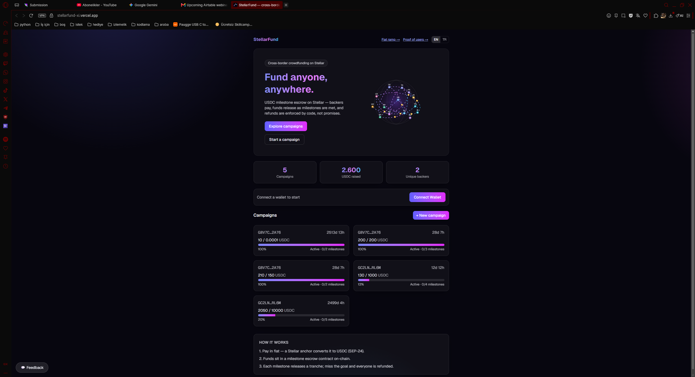
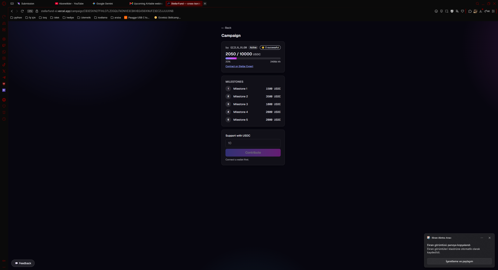
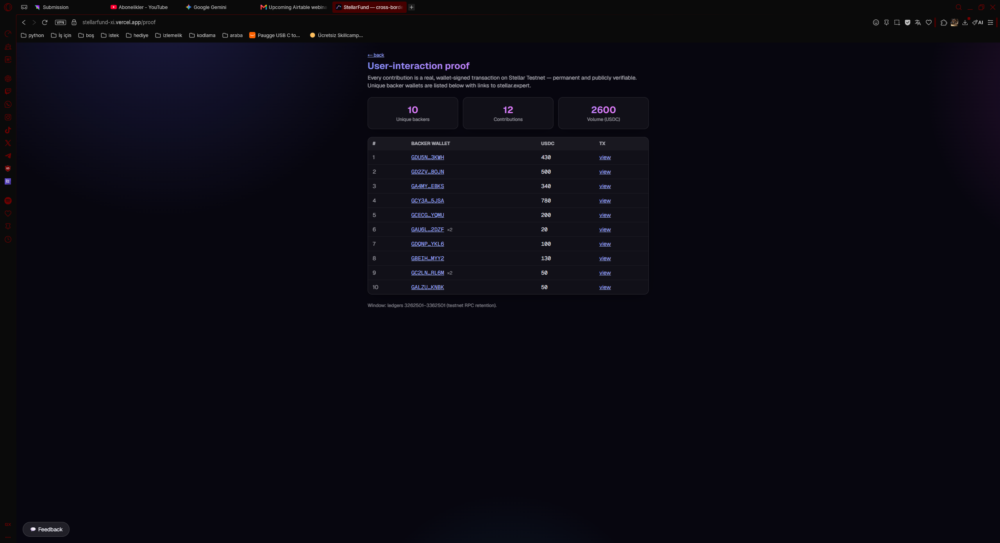
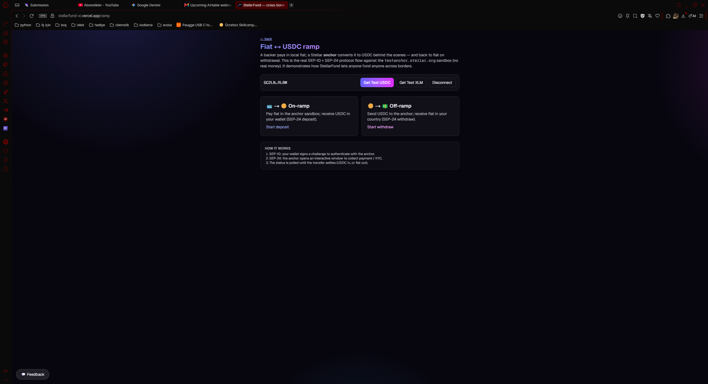
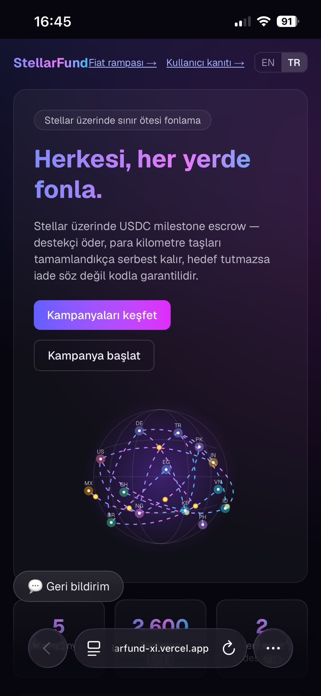
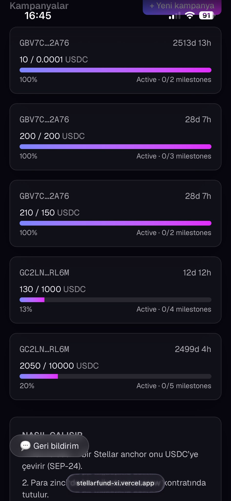

# StellarFund — Level 4 (Green Belt) Submission

## Links

- **Public GitHub repo:** https://github.com/BerkeBakir/stellarfund
- **Live demo:** https://stellarfund-xi.vercel.app
- **Demo video:** _recorded (screen capture) — upload to YouTube and paste the link here_
- **Proof board (in-app):** https://stellarfund-xi.vercel.app/proof
- **Fiat ramp demo (in-app):** https://stellarfund-xi.vercel.app/ramp

## Contract addresses (Stellar Testnet)

| Component | Address |
|---|---|
| Factory | [`CDNLINFENSRBB3WZ4JCSJC5PPJT6CZJPSQ7EY5W2HC4UYZVHMGVHVNAF`](https://stellar.expert/explorer/testnet/contract/CDNLINFENSRBB3WZ4JCSJC5PPJT6CZJPSQ7EY5W2HC4UYZVHMGVHVNAF) |
| Reputation | [`CCRWJWU42LP3ATOA6R4SJ4532XXQO6VSIXS5BWNQTZZVYAUSZCG5U7P4`](https://stellar.expert/explorer/testnet/contract/CCRWJWU42LP3ATOA6R4SJ4532XXQO6VSIXS5BWNQTZZVYAUSZCG5U7P4) |
| USDC (test SAC) | [`CD4PMJAYGZ6DJI7R47PS7SUJ733GU7B4GEA6W7DKLDM5HJM3TGRPHZE7`](https://stellar.expert/explorer/testnet/contract/CD4PMJAYGZ6DJI7R47PS7SUJ733GU7B4GEA6W7DKLDM5HJM3TGRPHZE7) |

Sample on-chain transactions are listed in [`DEPLOYMENT.md`](DEPLOYMENT.md).

## Requirements checklist

- [x] Production-ready MVP (stable frontend + contract architecture)
- [x] Mobile responsive UI + loading/error states
- [x] Smart contracts deployed on Stellar Testnet
- [x] Monitoring & analytics (Vercel Analytics + Sentry, DSN-gated)
- [x] Proper project structure & documentation (README, DEPLOYMENT, design spec, plan)
- [x] 15+ meaningful commits
- [x] Public GitHub repository — https://github.com/BerkeBakir/stellarfund
- [x] **Live deployment** — https://stellarfund-xi.vercel.app (Vercel)
- [x] **Min. 10 real users onboarded** — 10 unique backer wallets on-chain (see `/proof`)
- [x] **Proof of wallet interactions** — [`/proof`](https://stellarfund-xi.vercel.app/proof) board: 10 backers, 12 contributions, 2600 USDC + stellar.expert links
- [x] **Basic user feedback collection** — feedback widget live (`/api/feedback`)
- [x] **Demo video** — recorded (link below)

## User testing plan (how the 10+ interactions happen)

1. Deploy is live (Phase F). Seed 2–3 demo campaigns.
2. Each participant opens the live link → connects a wallet (Freighter) → taps **Get Test USDC**
   (auto: fund + USDC trustline + 500 USDC mint) → **Contributes** to a campaign.
3. Every `contribute` is a permanent, wallet-signed Testnet transaction → it appears
   automatically on the **`/proof`** board with a stellar.expert link.
4. Aim for several genuine participants; a hybrid (real people + own wallets, spread over time)
   is acceptable on testnet but real users are strongest for the product-validation signal.

**Where reviewers verify the interactions:**
- In-app `/proof` board (unique backer wallets + amounts + tx links)
- stellar.expert / Horizon (independent, permanent public record of every tx and contract)
- This document's transaction list (filled in after testing)

### Recorded interactions (fill in after testing)

| # | Wallet (stellar.expert) | Tx hash | Amount (USDC) |
|---|---|---|---|
| 1 | _…_ | _…_ | _…_ |
| … | | | |

## Feedback summary (fill in after testing)

Collected via the in-app feedback widget (`/api/feedback`).

| Rating | Wallet | Comment |
|---|---|---|
| _…_ | _…_ | _…_ |

## Screenshots

| View | Image |
|---|---|
| Landing / hero (desktop) |  |
| Campaign detail + milestones |  |
| Proof board (10 unique backers) |  |
| Fiat ↔ USDC ramp (SEP-24) |  |
| Mobile responsive — home |  |
| Mobile responsive — campaigns |  |

## Demo video script (~2–3 min)

1. Intro: the problem (cross-border funding) + StellarFund's one-liner.
2. Connect wallet → **Get Test USDC** (one tap).
3. Browse a campaign → show the **milestone timeline** → **Contribute** (USDC, real tx).
4. Show the live event + the `/proof` board updating with the backer wallet.
5. Creator: after goal+deadline, **release** a milestone tranche (sequential).
6. `/ramp`: run the **SEP-24** fiat→USDC on-ramp against the test anchor.
7. Wrap: architecture (Factory→Escrow→Reputation), analytics, TR/EN toggle.
